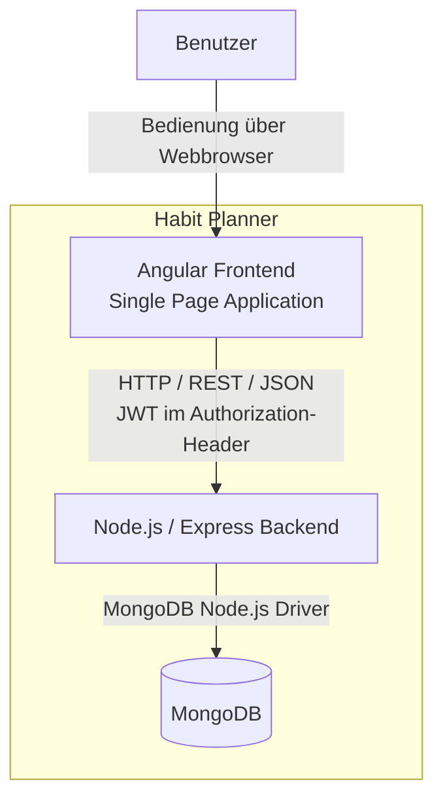

# 3. Kontextabgrenzung

Der Habit Planner ist eine eigenständige Webanwendung. Externe Systeme wie
Kalenderdienste, Fitness-Plattformen oder Benachrichtigungsdienste werden nicht
angebunden.

Aus fachlicher Sicht ist der Benutzer der einzige externe
Kommunikationspartner des Systems.

## 3.1 Fachlicher Kontext

Der Benutzer verwendet den Habit Planner zur Verwaltung und Erfassung seiner
Gewohnheiten. Die vom Benutzer eingegebenen Daten werden persistent gespeichert
und zur Darstellung des Kalenders und zur Berechnung der Statistiken verwendet.

| Kommunikation | Eingabe in das System | Ausgabe des Systems |
|---|---|---|
| Registrierung | Benutzername und Passwort | Ergebnis der Registrierung |
| Anmeldung | Benutzername und Passwort | Authentifizierte Sitzung im Frontend |
| Habit-Verwaltung | Name, Typ und Kategorie eines Habits | Gespeicherte Habit-Daten |
| Habit-Planung | Habit und ausgewähltes Datum | Geplanter Habit-Eintrag |
| Habit-Erfassung | Status eines positiven Habits beziehungsweise Auftreten eines negativen Habits | Aktualisierter Habit-Eintrag |
| Kalender | Auswahl von Monat und Tag | Habit-Einträge des dargestellten Zeitraums |
| Statistik | Keine separate Benutzereingabe; Auswertung der gespeicherten Habit-Einträge | Erfolgsrate sowie Auswertungen nach Habit und Kategorie |

Die Statistik verwendet ausschliesslich bereits im System gespeicherte
Habit- und HabitEntry-Daten. Es werden keine Daten von externen Diensten
bezogen.

## 3.2 Technischer Kontext

Der Benutzer greift mit einem Webbrowser auf das Angular-Frontend zu.
Der Browser führt die Single Page Application aus und stellt die
Benutzeroberfläche dar.

Für Datenoperationen sendet das Angular-Frontend HTTP-Requests an die
REST-Endpunkte des Express-Backends. Request- und Response-Bodies werden als
JSON übertragen.

Nach erfolgreicher Anmeldung erhält das Frontend einen JSON Web Token (JWT).
Bei geschützten API-Aufrufen wird dieser Token im `Authorization`-Header an
das Backend übertragen.

Angular-Frontend, Express-Backend und MongoDB liegen innerhalb der
Systemgrenze des Habit Planners. Ihre interne Struktur und ihre Abhängigkeiten
werden in Kapitel 5 beschrieben. Die konkrete Verteilung der Anwendung wird
in Kapitel 7 dokumentiert.

## 3.3 Technische Schnittstellen

| Schnittstelle | Übertragung | Inhalt |
|---|---|---|
| Benutzer → Frontend | Webbrowser | Interaktion mit der Benutzeroberfläche |
| Frontend → Backend | HTTP / REST | API-Requests für Authentifizierung, Habits und Habit-Einträge |
| Frontend ↔ Backend | JSON | Request- und Response-Daten der REST-API |
| Frontend → Backend | `Authorization: Bearer <JWT>` | Authentifizierungsinformation für geschützte Endpunkte |
| Backend → MongoDB | MongoDB Node.js Driver | Lesen und Schreiben von Benutzern, Habits und Habit-Einträgen |