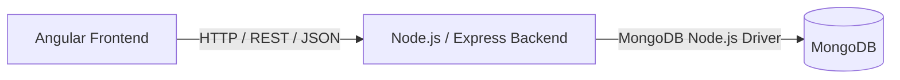
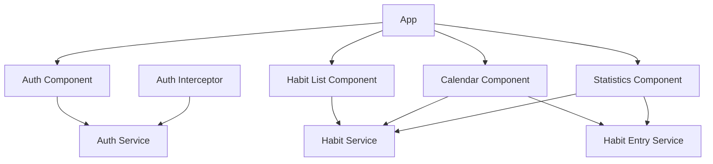
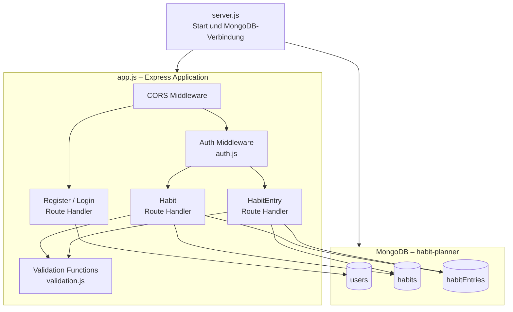

# 5. Bausteinsicht

Dieses Kapitel beschreibt die statische Struktur des Habit Planners und die
Verantwortlichkeiten der einzelnen Softwarebausteine.

Auf oberster Ebene besteht die Anwendung aus einem Angular-Frontend, einem
Node.js-/Express-Backend und einer MongoDB-Datenbank.

## 5.1 Ebene 1 – Gesamtsystem



| Baustein | Verantwortung |
|---|---|
| Angular-Frontend | Führt die Single Page Application im Browser aus, verarbeitet Benutzerinteraktionen und sendet HTTP-Requests an das Backend. |
| Node.js-/Express-Backend | Stellt die REST-Endpunkte bereit, verarbeitet Requests, führt Authentifizierungs-, Autorisierungs- und Validierungsprüfungen aus und führt Datenbankoperationen durch. |
| MongoDB | Speichert Benutzer, Habits und Habit-Einträge persistent. |

## 5.2 Ebene 2 – Angular-Frontend

Das Frontend ist in Komponenten für die Benutzeroberfläche und Services für
Datenzugriff und Zustandsverwaltung aufgeteilt.

Die Hauptkomponente bindet die Komponenten für Authentifizierung,
Statistik, Kalender und Habit-Verwaltung ein. Der Zugriff auf das Backend
erfolgt über Angular-Services.



### Frontend-Komponenten

| Baustein | Verantwortung |
|---|---|
| App | Oberste Anwendungskomponente. Bindet die Authentifizierung ein und zeigt nach erfolgreicher Anmeldung Statistik, Kalender und Habit-Verwaltung an. |
| Auth Component | Stellt Registrierung und Anmeldung bereit und übergibt die eingegebenen Daten an den Auth Service. |
| Habit List Component | Zeigt die Habits des angemeldeten Benutzers an und stellt Funktionen zum Erstellen, Bearbeiten und Löschen bereit. |
| Calendar Component | Stellt Habit-Einträge nach Datum dar. Positive Habits können geplant und anschließend als erledigt oder verpasst erfasst werden. Das Auftreten negativer Habits kann für einen ausgewählten Tag eingetragen werden. |
| Statistics Component | Verwendet Habit- und HabitEntry-Daten zur Berechnung und Darstellung der Gesamt-, Habit- und Kategorieauswertungen. |

### Frontend-Services

| Baustein | Verantwortung |
|---|---|
| Auth Service | Sendet Registrierungs- und Login-Requests an das Backend und verwaltet den JWT sowie den Authentifizierungszustand im Frontend. |
| Habit Service | Sendet HTTP-Requests zum Lesen, Erstellen, Bearbeiten und Löschen von Habits und stellt Habit-Daten für die Komponenten bereit. |
| Habit Entry Service | Sendet HTTP-Requests zum Lesen, Erstellen, Bearbeiten und Löschen von Habit-Einträgen und stellt HabitEntry-Daten für Kalender und Statistik bereit. |
| Auth Interceptor | Fügt bei vorhandenem JWT den Bearer Token zum `Authorization`-Header ausgehender HTTP-Requests hinzu. |

## 5.3 Ebene 2 – Express-Backend

Das Backend wird über `server.js` gestartet. Dort wird mit dem offiziellen
MongoDB Node.js Driver eine Verbindung zur Datenbank aufgebaut. Anschließend
werden die verwendeten MongoDB-Collections an die Express-Anwendung
übergeben.

Die Express-Anwendung wird in `app.js` erstellt. Dort befinden sich die
Route Handler für Registrierung, Anmeldung, Habits und Habit-Einträge.
Die JWT-Prüfung und Teile der Eingabevalidierung sind in separate Module
ausgelagert.



### Backend-Bausteine

| Baustein | Verantwortung |
|---|---|
| `server.js` | Lädt die Umgebungsvariablen, baut die MongoDB-Verbindung auf, erhält Referenzen auf die verwendeten Collections und startet den HTTP-Server. |
| `app.js` | Erstellt und konfiguriert die Express-Anwendung und enthält die Route Handler für Authentifizierung, Habits und Habit-Einträge. |
| CORS Middleware | Legt fest, von welchen Frontend-Origins Requests an das Backend zugelassen werden. |
| Register / Login Route Handler | Verarbeitet Registrierung und Anmeldung. Bei der Registrierung wird das Passwort mit bcrypt gehasht. Beim Login werden die Anmeldedaten geprüft und ein JWT erzeugt. |
| `auth.js` | Liest den Bearer Token aus dem `Authorization`-Header, validiert den JWT und stellt die Benutzerinformation für nachfolgende Route Handler bereit. |
| Habit Route Handler | Verarbeitet CRUD-Operationen für Habits. Die Datenbankoperationen werden auf den authentifizierten Benutzer eingeschränkt. Beim Löschen eines Habits werden auch dessen Habit-Einträge entfernt. |
| HabitEntry Route Handler | Verarbeitet das Erstellen, Lesen, Ändern und Löschen von Habit-Einträgen. Die Operationen werden auf den authentifizierten Benutzer eingeschränkt. |
| `validation.js` | Enthält Funktionen zur Prüfung von Habit-Daten und zulässigen HabitEntry-Statuswerten. |

## 5.4 Persistenz

Die Daten des Habit Planners werden in der MongoDB-Datenbank
`habit-planner` gespeichert.

Die Anwendung verwendet drei Collections:

| Collection | Inhalt |
|---|---|
| `users` | Benutzerkonten mit Benutzername und gehashtem Passwort. |
| `habits` | Habits mit Name, Typ, Kategorie und Zuordnung zum Benutzer. |
| `habitEntries` | Habit-Einträge mit Zuordnung zu Habit und Benutzer sowie Datum und Status. |

Habits und Habit-Einträge enthalten eine Benutzerzuordnung. Das Backend
verwendet bei geschützten Datenbankoperationen die Benutzer-ID aus dem
validierten JWT, um die Daten des angemeldeten Benutzers auszuwählen.

Ein HabitEntry referenziert zusätzlich den zugehörigen Habit. Beim Löschen
eines Habits löscht das Backend auch die zu diesem Habit gehörenden
Habit-Einträge.

## 5.5 Abhängigkeiten zwischen den Bausteinen

Die Abhängigkeiten zwischen den Hauptbausteinen verlaufen vom Frontend über
das Backend zur Datenbank:

```text
Angular Components
       ↓
Angular Services
       ↓
HTTP / REST
       ↓
Express Route Handler
       ↓
MongoDB Node.js Driver
       ↓
MongoDB Collections
```

Das Angular-Frontend greift nicht direkt auf MongoDB zu. Sämtliche
Datenbankoperationen werden vom Express-Backend ausgeführt.

Die Angular-Komponenten führen ebenfalls keine direkten Datenbankoperationen
aus. Für serverseitige Daten verwenden sie die dafür vorgesehenen
Angular-Services.

Authentifizierte HTTP-Requests werden im Backend vor der Verarbeitung durch
geschützte Route Handler von der Auth Middleware geprüft.