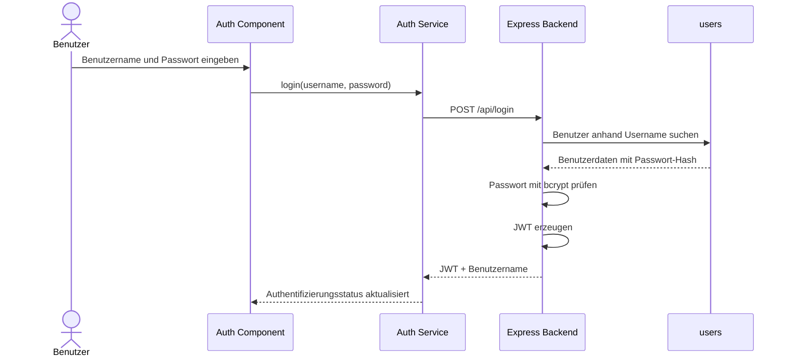
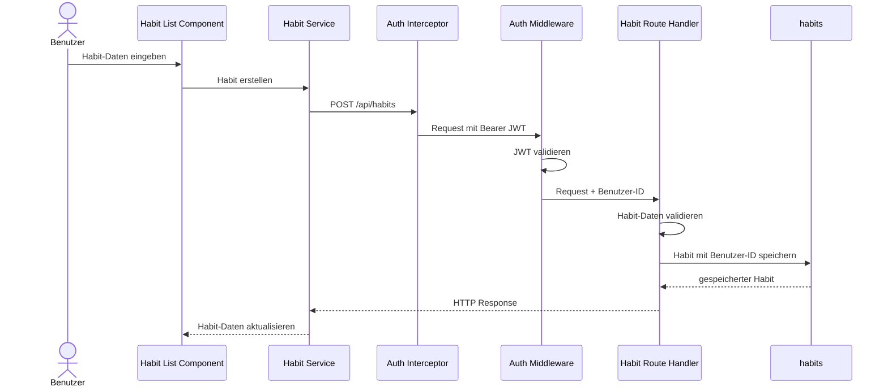
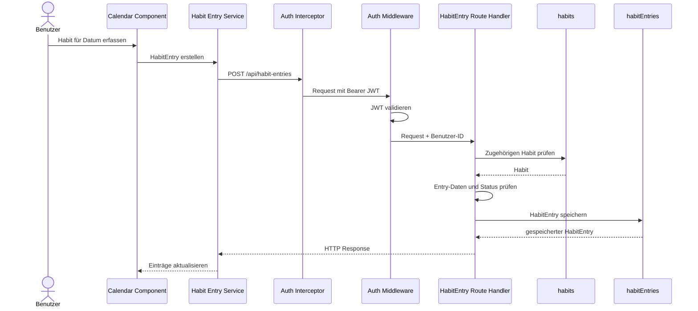

# 6. Laufzeitsicht

Dieses Kapitel beschreibt die Interaktion der Softwarebausteine während
ausgewählter Abläufe. Dargestellt werden HTTP-Kommunikation,
Authentifizierung und Datenbankzugriffe.

## 6.1 Anmeldung

Der Benutzer gibt Benutzername und Passwort im Auth Component ein. Der
Auth Service sendet die Anmeldedaten an das Backend. Das Backend sucht den
Benutzer in der `users`-Collection und prüft das eingegebene Passwort gegen
den gespeicherten bcrypt-Hash.

Bei erfolgreicher Prüfung erzeugt das Backend einen JWT und sendet diesen an
das Frontend zurück. Der Auth Service übernimmt den Token für nachfolgende
authentifizierte Requests.

Bei ungültigen Anmeldedaten wird kein JWT erzeugt und das Backend beantwortet
den Login-Request mit einem Fehlerstatus.

## 6.2 Habit erstellen

Nach erfolgreicher Anmeldung kann der Benutzer einen Habit erstellen. Der
Habit List Component übergibt die eingegebenen Habit-Daten an den Habit
Service.

Der Auth Interceptor ergänzt den HTTP-Request um den gespeicherten JWT.
Im Backend prüft die Auth Middleware den Token. Anschliessend werden die
Habit-Daten validiert und zusammen mit der Benutzerzuordnung in der
`habits`-Collection gespeichert.

Die Benutzer-ID wird nicht aus den Habit-Daten des Frontends übernommen,
sondern aus dem zuvor validierten JWT verwendet.

## 6.3 Habit-Eintrag erfassen

Habit-Einträge werden über den Kalender erfasst. Bei positiven Habits kann
ein Habit zunächst für einen Tag geplant und später als `completed` oder
`missed` markiert werden. Bei negativen Habits wird ein Auftreten mit dem
Status `occurred` gespeichert.

Der Calendar Component verwendet dafür den Habit Entry Service. Wie bei
anderen geschützten Requests ergänzt der Auth Interceptor den JWT und die
Auth Middleware validiert diesen im Backend.

Mehrere Habit-Einträge für denselben Habit und dasselbe Datum sind zulässig.
Dadurch kann beispielsweise das mehrfache Auftreten eines negativen Habits
am selben Tag separat erfasst werden.

Positive Habits werden nicht automatisch als `missed` markiert. Die Änderung
von `planned` zu `completed` oder `missed` erfolgt durch eine explizite
Benutzeraktion.