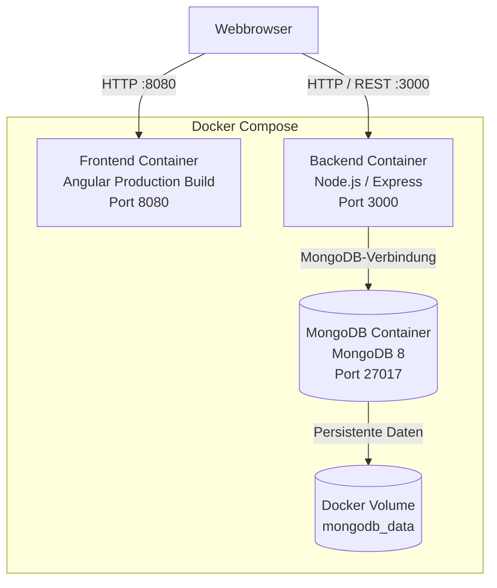

# 7. Verteilungssicht

Der Habit Planner kann vollständig über Docker Compose ausgeführt werden.
Frontend, Backend und MongoDB laufen dabei in getrennten Containern.

Der Webbrowser des Benutzers läuft ausserhalb der Docker-Umgebung und greift
über den veröffentlichten Frontend-Port auf die Anwendung zu.

## 7.1 Docker-Umgebung



## 7.2 Laufzeitkomponenten

| Laufzeitkomponente | Aufgabe |
|---|---|
| Webbrowser | Lädt das Frontend und führt die Angular Single Page Application aus. |
| Frontend-Container | Stellt den gebauten Angular-Production-Build über Port `8080` bereit. |
| Backend-Container | Führt die Node.js-/Express-Anwendung aus und stellt die REST-API über Port `3000` bereit. |
| MongoDB-Container | Führt MongoDB 8 aus und stellt die persistente Datenbank des Habit Planners bereit. |
| `mongodb_data` | Docker Volume für die Daten von MongoDB. Die Daten bleiben dadurch auch nach dem Entfernen und erneuten Erstellen des MongoDB-Containers erhalten. |

## 7.3 Kommunikation

Die Angular-Anwendung wird vom Frontend-Container an den Webbrowser
ausgeliefert und anschliessend im Browser ausgeführt.

API-Aufrufe werden vom Browser an das Express-Backend auf Port `3000`
gesendet. Das Backend greift auf MongoDB zu. Der Browser und das
Angular-Frontend greifen nicht direkt auf MongoDB zu.

Für geschützte REST-Aufrufe sendet das Angular-Frontend den JWT im
`Authorization`-Header an das Backend.

Die MongoDB-Daten werden im Docker Volume `mongodb_data` gespeichert und
liegen dadurch ausserhalb des beschreibbaren Dateisystems des
MongoDB-Containers.

## 7.4 Start der Anwendung

Die Container werden aus der Compose-Konfiguration des Projekts gebaut und
gestartet:

```powershell
docker compose up --build
```

Nach dem Start ist das Frontend über

```text
http://localhost:8080
```

erreichbar. Die REST-API des Backends ist über Port `3000` erreichbar.